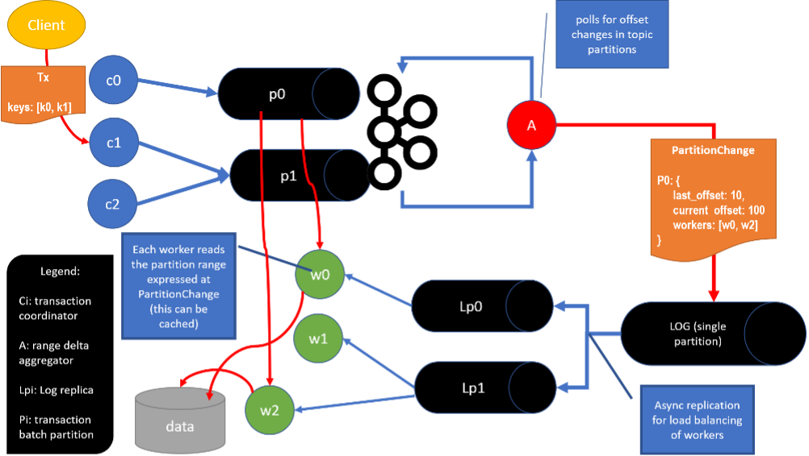

# scheduler
Distributed Scalable Transactional Scheduler

Deterministic Distributed Transactional Scheduling Layer

The layer implements the Scalog Protocol (https://www.usenix.org/system/files/nsdi20-paper-ding.pdf) with slightly modifications. It uses apache Kafka to amortize the collecting of transactions. Basically, the cluster coordinators batch transactions and send the batch to Kafka partitions in the local cluster (interval of 10 ms). At a configurable interval (generally 10 ms), nodes called aggregators consume meta information about the changes in partition offsets, create a batch of changes and ship it to the central log (that has a single partition). That design allows for high throughput in cost of some latency. In the execution phase , there are nodes called workers which read the meta information from the meta log and actually go read the payload in the partition (meta information is a pointer to the partition). Each worker is responsible for a range of the data. At the time of publishing of a transaction, all workers involved in a transaction are calculated hashing the key and applying module by the number of workers. The list of workers involved is sorted and the first worker of the list will be responsible to process the batch of txs while the rest of the workers block until the leader worker sends message to proceed to the next batch in the log. Using this approach, the workload in the cluster can be parallelized and deterministically scheduled and executed.
The following diagram illustrates a high level overview of the system’s architecture: 

	 	  
